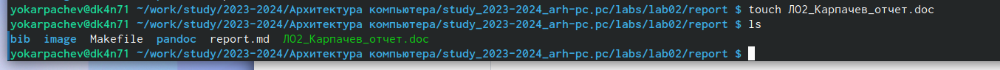

---
## Front matter
title: "Отчет по лабораторной работе №2"
subtitle: "Дисциплина: Архитектура компьютера"
author: "Карпачев Ярослав Олегович"

## Generic otions
lang: ru-RU
toc-title: "Содержание"

## Bibliography
bibliography: bib/cite.bib
csl: pandoc/csl/gost-r-7-0-5-2008-numeric.csl

## Pdf output format
toc: true # Table of contents
toc-depth: 2
lof: true # List of figures
lot: true # List of tables
fontsize: 12pt
linestretch: 1.5
papersize: a4
documentclass: scrreprt
## I18n polyglossia
polyglossia-lang:
  name: russian
  options:
	- spelling=modern
	- babelshorthands=true
polyglossia-otherlangs:
  name: english
## I18n babel
babel-lang: russian
babel-otherlangs: english
## Fonts
mainfont: PT Serif
romanfont: PT Serif
sansfont: PT Sans
monofont: PT Mono
mainfontoptions: Ligatures=TeX
romanfontoptions: Ligatures=TeX
sansfontoptions: Ligatures=TeX,Scale=MatchLowercase
monofontoptions: Scale=MatchLowercase,Scale=0.9
## Biblatex
biblatex: true
biblio-style: "gost-numeric"
biblatexoptions:
  - parentracker=true
  - backend=biber
  - hyperref=auto
  - language=auto
  - autolang=other*
  - citestyle=gost-numeric
## Pandoc-crossref LaTeX customization
figureTitle: "Рис."
tableTitle: "Таблица"
listingTitle: "Листинг"
lofTitle: "Список иллюстраций"
lotTitle: "Список таблиц"
lolTitle: "Листинги"
## Misc options
indent: true
header-includes:
  - \usepackage{indentfirst}
  - \usepackage{float} # keep figures where there are in the text
  - \floatplacement{figure}{H} # keep figures where there are in the text
---

# Цель работы

	Целью работы является изучить Git. Приобрести практические навыки по работе с системой git.

# Задание

1. Настройка GitHub.
2. Базовая настройка Git.
3. Создание SSH-ключа.
4. Создание рабочего пространства и репозитория курса на основе шаблона.
5. Создание репозитория курса на основе шаблона.
6. Настройка каталога курса.
7. Выполнение заданий для самостоятельной работы.

# Теоретическое введение

	Системы контроля версий (Version Control System, VCS) применяются при работе нескольких человек над одним проектом. Обычно основное дерево проекта хранится в локальном или удалённом репозитории, к которому настроен доступ для участников проекта. При внесении изменений в содержание проекта система контроля версий позволяет их фиксировать, совмещать изменения, произведённые разными участниками проекта, производить откат к любой более ранней версии проекта, если это требуется.
	В классических системах контроля версий используется централизованная модель, предполагающая наличие единого репозитория для хранения файлов. Участник проекта (пользователь) перед началом работы посредством определённых команд получает нужную ему версию файлов. После внесения изменений пользователь размещает новую версию в хранилище. При этом предыдущие версии не удаляются из центрального хранилища и к ним можно вернуться в любой момент. Системы контроля версий поддерживают возможность отслеживания и разрешения конфликтов, которые могут возникнуть при работе нескольких человек над одним файлом. Можно объединить (слить) изменения, сделанные разными участниками (автоматически или вручную), вручную выбрать нужную версию, отменить изменения вовсе или заблокировать файлы для изменения.
	Системы контроля версий также могут обеспечивать дополнительные, более гибкие функциональные возможности. Например, они могут поддерживать работу с несколькими версиями одного файла, сохраняя общую историю изменений до точки ветвления версий и собственные истории изменений каждой ветви. Кроме того, обычно доступна информация о том, кто из участников, когда и какие изменения вносил.
	В отличие от классических, в распределённых системах контроля версий центральный репозиторий не является обязательным.
	Система контроля версий Git представляет собой набор программ командной строки. Доступ к ним можно получить из терминала посредством ввода команды git с различными опциями. Благодаря тому, что Git является распределённой системой контроля версий, резервную копию локального хранилища можно сделать простым копированием или архивацией.
	
: Основные команды git{#tbl:std-dir}

| Команда | Описание                                                                                                           |
|--------------|----------------------------------------------------------------------------------------------------------------------------|
| `git init`          | создание основного дерева репозитория                                                            |
| `git pull `      | получение обновлений (изменений) текущего дерева из центрального репозитория     |
| `git push`       | отправка всех произведённых изменений локального дерева в центральный репозиторий                                           |
| `git status`      | просмотр списка изменённых файлов в текущей директории |
| `git diff`     | просмотр текущих изменения                                                                                   |
| `git add`      | добавить все изменённые и/или созданные файлы и/или каталоги                                                                                     |
| `git add имена_файлов`       | добавить конкретные изменённые и/или созданные файлы и/или каталоги                                                                                                            |
| `git rm имена_файлов`       | удалить файл и/или каталог из индекса репозитория (при этом файл и/или каталог остаётся в локальной директории)                                                                                 |
| `git commit -am 'Описание коммита'`      | сохранить все добавленные изменения и все изменённые файлы |
| `git checkout -b имя_ветки`      | создание новой ветки, базирующейся на текущей |
| `git checkout имя_ветки`      | переключение на некоторую ветку (при переключении на ветку, которой ещё нет в локальном репозитории, она будет создана и связана с удалённой) |
| `git push origin имя_ветки`      | отправка изменений конкретной ветки в центральный репозиторий |
| `git merge --no-ff имя_ветки`      | слияние ветки с текущим деревом |
| `git branch -d имя_ветки`      | удаление локальной уже слитой с основным деревом ветки |
| `git branch -D имя_ветки`      | принудительное удаление локальной ветки |
| `git push origin :имя_ветки`      | удаление ветки с центрального репозитория |

# Выполнение лабораторной работы

## Настройка GitHub

Создал учетную запись на сайте https://github.com/(рис. 1).

{#fig:001 width=70%}

## Базовая настройка Git

Произвел базовые настройки Git, emain, name и тд (рис. 2).

{#fig:002 width=70%}

## Создание SSH-ключа

Сгенерировал ключи приватный и открытый (рис. 3). Просмотрел с помощью cat, скопировал его, вставил в Github (рис. 4). Авторизовала ключ (рис. 5).

{#fig:003 width=70%}

{#fig:004 width=70%}

{#fig:005 width=70%}

## Создание репозитория курса на основе шаблона

На основе шаблона создал свой репозиторий (рис 6.)

{#fig:008 width=70%}

Открыл терминал и перешел в каталог. Клонировала созданный репозиторий, скопировав ссылку для клонирования на странице созданного репозитория Code -> SSH (рис. 7).

{#fig:009 width=70%}

## Настройка каталога курса

Удалил лишние файлы с помощью команды rm (рис. 8).

{#fig:010 width=70%}

создал необходимые каталоги с помощью git add, прокомментировал и сохранил изменения на сервере как добавление с помощью git commit (рис. 9), и отправил изменения на сервер (рис. 10) и проверил на гитхаб равильность действий (рис. 11)

{#fig:011 width=70%}

{#fig:012 width=70%}

{#fig:013 width=70%}

## Выполнение заданий для самостоятельной работы

Перехожу в директорию labs/lab02/report с помощью утилиты cd. Создаю в каталоге файл для отчета по второй лабораторной работе с помощью утилиты touch, оформио его и отправил на сервер. (рис. 12).

{#fig:014 width=70%}

Перенес (копировал) и загрузил предыдущий отчет на сервер в каталог labs/lab01/report. И проверил правильность действий на Github.

{#fig:015 width=70%}

{#fig:016 width=70%}

# Выводы

В ходе лабораторной работы я получил практически навыки работы с системой git, а также изучил Git посредством выполнения практических заданий.

# Список литературы{.unnumbered}

::: {#refs}
:::
