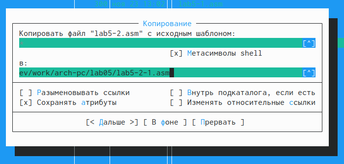
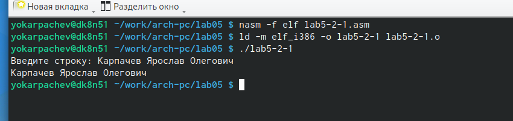

---
## Front matter
title: "Лабораторная работа №5"
subtitle: "Дисциплина: Архитектура компьютера"
author: "карпачев Ярослав Олегович"

## Generic otions
lang: ru-RU
toc-title: "Содержание"

## Bibliography
bibliography: bib/cite.bib
csl: pandoc/csl/gost-r-7-0-5-2008-numeric.csl

## Pdf output format
toc: true # Table of contents
toc-depth: 2
lof: true # List of figures
fontsize: 12pt
linestretch: 1.5
papersize: a4
documentclass: scrreprt
## I18n polyglossia
polyglossia-lang:
  name: russian
  options:
	- spelling=modern
	- babelshorthands=true
polyglossia-otherlangs:
  name: english
## I18n babel
babel-lang: russian
babel-otherlangs: english
## Fonts
mainfont: PT Serif
romanfont: PT Serif
sansfont: PT Sans
monofont: PT Mono
mainfontoptions: Ligatures=TeX
romanfontoptions: Ligatures=TeX
sansfontoptions: Ligatures=TeX,Scale=MatchLowercase
monofontoptions: Scale=MatchLowercase,Scale=0.9
## Biblatex
biblatex: true
biblio-style: "gost-numeric"
biblatexoptions:
  - parentracker=true
  - backend=biber
  - hyperref=auto
  - language=auto
  - autolang=other*
  - citestyle=gost-numeric
## Pandoc-crossref LaTeX customization
figureTitle: "Рис."
tableTitle: "Таблица"
listingTitle: "Листинг"
lofTitle: "Список иллюстраций"
lolTitle: "Листинги"
## Misc options
indent: true
header-includes:
  - \usepackage{indentfirst}
  - \usepackage{float} # keep figures where there are in the text
  - \floatplacement{figure}{H} # keep figures where there are in the text
---

# Цель работы

  Приобретение практических навыков в Midnight Commander. Освоение инструкций языка ассемблера mov и int.

# Задание

1. Основы работы с mc.
2. Структура программы на языке ассемблера NASM.
3. Подключение внешнего файла.
4. Выполнение заданий для самостоятельной работы.


# Теоретическое введение

Midnight Commander (или просто mc) — это программа, которая позволяет просматривать структуру каталогов и выполнять основные операции по управлению файловой системой, т.е. mc является файловым менеджером. Midnight Commander позволяет сделать работу с файлами более удобной и наглядной.
Программа на языке ассемблера NASM, как правило, состоит из трёх секций: секция кода программы (SECTION .text), секция инициированных (известных во время компиляции) данных (SECTION .data) и секция неинициализированных данных (тех, под которые во время компиляции только отводится память, а значение присваивается в ходе выполнения программы) (SECTION .bss).
Для объявления инициированных данных в секции .data используются директивы DB, DW, DD, DQ и DT, которые резервируют память и указывают, какие значения должны храниться в этой памяти:
- DB (define byte) — определяет переменную размером в 1 байт;
- DW (define word) — определяет переменную размеров в 2 байта (слово);
- DD (define double word) — определяет переменную размером в 4 байта (двойное слово);
- DQ (define quad word) — определяет переменную размером в 8 байт (учетве-
рённое слово);
- DT (define ten bytes) — определяет переменную размером в 10 байт. Директивы используются для объявления простых переменных и для объявления массивов. Для определения строк принято использовать директиву DB в связи с особенностями хранения данных в оперативной памяти.
Инструкция языка ассемблера mov предназначена для дублирования данных источника в приёмнике. 
```NASM
mov dst,src
```
Здесь операнд dst — приёмник, а src — источник.
В качестве операнда могут выступать регистры (register), ячейки памяти (memory) и непосредственные значения (const).
Инструкция языка ассемблера intпредназначена для вызова прерывания с
указанным номером. 
```NASM
int n
```
Здесь n — номер прерывания, принадлежащий диапазону 0–255. При программировании в Linux с использованием вызовов ядра sys_calls n=80h (принято задавать в шестнадцатеричной системе счисления).

## Основы работы с Midnight Commander

  Midnight Commander (или просто mc) — это программа, которая позволяет просматривать структуру каталогов и выполнять основные операции по управлению файловой системой, т.е. mc является файловым менеджером. Midnight Commander позволяет сделать работу с файлами более удобной и наглядной.
 В Midnight Commander используются функциональные клавиши _F1 — F10_, к которым привязаны часто выполняемые операции (табл. @tbl:std-dir).

: Функциональные клавиши Midnight Commander {#tbl:std-dir}

| Функциональные клавиши | Выполняемое действие                                                                                                     |
|------------------------|--------------------------------------------------------------------------------------------------------------------------|
| F1                     | вызов контекстно-зависимой подсказки                                                                                     |
| F2                     | вызов меню, созданного пользователем                                                                                     |
| F3                     | просмотр файла, на который указывает подсветка в активной панели                                                         |
| F4                     | вызов встроенного редактора для файла, на который указывает подсветка в активной панели                                  |
| F5                     | копирование файла (группы файлов из каталога), отображаемого в активной панели, в каталог, отображаемый на второй панели |
| F6                     | перенос файла (группы файлов из каталога), отображаемого в активной панели, в каталог, отображаемый на второй панели     |
| F7                     | создание подкаталога в каталоге, отображаемом в активной панели                                                          |
| F8                     | удаление файла (подкаталога) или группы отмеченных файлов                                                                |
| F9                     | вызов основного меню программы                                                                                           |
| F10                    | выход из программы                                                                                                       |


## Структура программы на языке ассемблера NASM   


  Программа на языке ассемблера NASM, как правило, состоит из трёх секций: секция кода программы (SECTION .text), секция инициированных (известных во время компиляции) данных (SECTION .data) и секция неинициализированных данных (тех, под которые во время компиляции только отводится память, а значение присваивается в ходе выполнения программы) (SECTION .bss).

  Для объявления инициированных данных в секции .data используются директивы DB, DW, DD, DQ и DT, которые резервируют память и указывают, какие значения должны храниться в этой памяти:

- DB (define byte) — определяет переменную размером в 1 байт;
- DW (define word) — определяет переменную размеров в 2 байта (слово);
- DD (define double word) — определяет переменную размером в 4 байта (двойное слово);
- DQ (define quad word) — определяет переменную размером в 8 байт (учетверённое слово);
- DT (define ten bytes) — определяет переменную размером в 10 байт. 

  Директивы используются для объявления простых переменных и для объявления массивов. Для определения строк принято использовать директиву DB в связи с особенностями хранения данных в оперативной памяти. Для определения строк принято использовать директиву DB в связи с особенностями хранения данных в оперативной памяти.

## Описание инструкции mov 

  Инструкция языка ассемблера mov предназначена для дублирования данных источника в приёмнике.
```NASM
mov dst,src
```
  Здесь операнд dst — приёмник, а src — источник.
  В качестве операнда могут выступать регистры (register), ячейки памяти (memory) и непосредственные значения (const).
  
## Описание инструкций int

    Инструкция языка ассемблера int предназначена для вызова прерывания с указанным номером.
```NASM
int n
```
  Здесь n — номер прерывания, принадлежащий диапазону 0–255. При программировании в Linux с использованием вызовов ядра sys_calls n=80h (принято задавать в шестнадцатеричной системе счисления).


# Выполнение лабораторной работы 

## Основы работы с Midnight Commander
  
  Открыл Midnight Commander с mc. Перешел в каталог ~/work/arch-pc. С помощью F7 создал папку lab05 (рис. [-@fig:001]). Перешел в каталог и, пользуясь командой touch, создал файл lab5-1.asm (рис. [-@fig:003])
	
{#fig:001 width=70%}

{#fig:003 width=70%}

  С помощью функциональной клавиши F4 открыл файл lab5-1.asm для редактирования в редакторе. Скопировал текст программы из листинга 5.1, сохранил файл (рис. [-@fig:005]). С помощью F3 открыл файл lab5-1.asm для просмотра. Убедился, что файл содержит текст программы (рис. [-@fig:002]).
	
{#fig:005 width=70%}

{#fig:002 width=70%}

  Оттранслировал программу lab5-1.asm в объектный файл. Выполнил компоновку объектного файла и запустил исполняемый файл. Программа выводит строку 'Введите строку:' и ожидает ввода с клавиатуры. На запрос ввел свои ФИО (рис. [-@fig:006]).
	
{#fig:006 width=70%}


## Подключение внешнего файла in_out.asm

  Скачал файл in_out.asm со страницы курса в ТУИСе.
  С помощью функциональной клавиши F5 скопировал in_out.asm из каталога Загрузки в созданный каталог lab05 (рис. [-@fig:007]).

{ #fig:007 width=70% }
  
  С помощью функциональной клавиши F5 скопировал lab5-1 в тот же каталог, с другим именем. (рис. [-@fig:080]).

{ #fig:080 width=70% }

  Изменил содержимое файла lab5-2.asm в редакторе кода (рис. [-@fig:009]), чтобы в программе использовались подпрограммы из файла in_out.asm.

{ #fig:009 width=70% }

  Оттранслировал файл в объектный код командой nasm -f elf lab5-2.asm. Создался объектный файл lab5-2.o. Скомпоновал объектный файла с помощью команды ld -m elf_i386 -o lab5-2 lab5-2.o Создался исполняемый файл lab5-2. Запустил файл (рис. [-@fig:010]).

{ #fig:020 width=70% }

  Открыл файл lab5-2.asm с помощью F4. Изменил в нем подпрограмму sprintLF на sprint. Сохранил изменения и открыл файл для просмотра, чтобы проверить, что программа сохранилась. (рис. [-@fig:011]).
  
{ #fig:020 width=70% }

  Разница между первым файлом lab5-1 и вторым lab5-2 в том, Первый запрашивает ввод с новой строки, а lab5-2 запрашивает ввод без переноса на новую строку, потому что была замена sprintLF на sprint (рис. [-@fig:010]).
  
{ #fig:010 width=70% }


## Задание для самостоятельной работы

1. Создал копию файла lab5-1.asm с именем lab5-1-1.asm с помощью F5 (рис. [-@fig:013]).

{ #fig:013 width=70% }

С F4 открываю созданный файл для редактирования. Изменил программу так, чтобы она дополнительно выводита ФИО. (рис. [-@fig:014]).

{ #fig:014 width=70% }

Создал объектный файл, отдал его на обработку компоновщику, получил исполняемый файл lab5-1-1. Запустил полученный исполняемый файл. Все работает правильно, программа запрашивает ФИО и выводит его.(рис. [-@fig:015]).
 
{ #fig:015 width=70% }

2. Создал копию файла lab5-2.asm с именем lab5-2-1.asm с помощью F5 (рис. [-@fig:017]).

{ #fig:017 width=70% }

  С помощью функциональной клавиши F4 открывал созданный файл для редактирования. Изменил программу чтобы она дополнительно выводила ФИО. (рис. [-@fig:018]). 

{ #fig:018 width=70% }

Создал объектный файл, отдал его на обработку компоновщику, получил исполняемый файл lab5-2-1. Запустил полученный исполняемый файл. Все работает правильно, программа запрашивает ФИО и выводит его. (рис. [-@fig:019]).

{ #fig:019 width=70% }
  
# Выводы

  Я приобрел навыки работы в Midnight Commander, а также освоил инструкции языка ассемблера mov и int.


